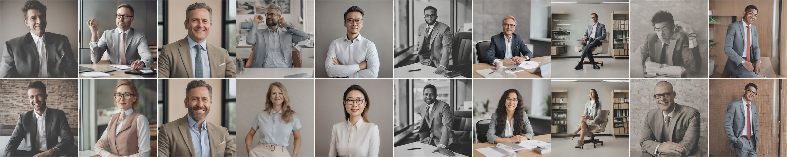
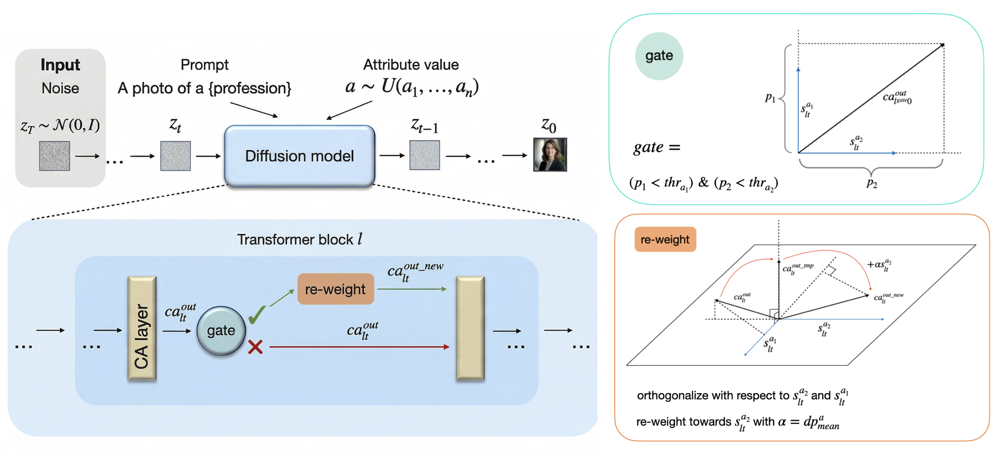

# EquiSteer: Cross-Attention Steering for Fairer Text-Guided Image Generation

[](https://arxiv.org/abs/2607.01147)

Official implementation of **"EquiSteer: Cross-Attention Steering for Fairer Text-Guided Image Generation"**.

<div>
    <strong>Accepted to ECCV 2026</strong>
</div>




*Examples of EquiSteer for debiasing the* gender *concept. Top block: generations for the prompt "A photo of a nurse" with SANA; bottom block: "A photo of a CEO" with SDXL. In both cases, the top row corresponds to the vanilla model and the bottom row to EquiSteer, with ten generation seeds shown for each prompt.*

## Overview

EquiSteer is a **training-free, inference-time framework** for debiasing text-to-image diffusion models. For each protected attribute (e.g. gender, race, age, body type, eyeglasses) it precomputes steering vectors from contrastive prompt pairs and calibrates per-direction gate thresholds. At generation time, a **prompt-aware gate** detects attribute-specific prompts and leaves them untouched, while for attribute-neutral prompts EquiSteer (i) orthogonalises the CA output against the attribute subspace, (ii) samples a target attribute value from a uniform distribution, and (iii) re-injects it at an adaptive magnitude.

EquiSteer builds on **[CASteer](https://github.com/Atmyre/CASteer)** (ICLR 2026) but repurposes cross-attention steering from concept *suppression* to **balanced attribute redistribution**, and adds the gate + adaptive magnitude components needed to preserve attribute-specific user intent.

## Method

At every cross-attention layer $l$ and denoising step $t$, EquiSteer combines three components:

1. **Gate** — thresholds the maximal token response $dp^{a}_{l^{gate} 0} = \max_k \langle ca^{out}_{l^{gate} 0 k}, s^{a}_{l^{gate} 0}\rangle$ at one chosen layer $l^{gate}$ and disables intervention when any attribute direction crosses its threshold $thr^{a}$;
2. **Orthogonalisation** — projects the CA output onto the complement of the attribute subspace $\mathrm{span}(\{s^{a_i}_{lt}\})$ to remove pre-existing attribute signal (Eq. 7 in the paper);
3. **Adaptive re-weighting** — re-adds the sampled attribute direction $s^{a}_{lt}$ at magnitude $\alpha = dp^{a}_{\text{mean}}(l,t)$ so the target attribute is expressed at natural strength (Eq. 8).



## Supported Models

- Stable Diffusion 1.5, Stable Diffusion 2.1
- Stable Diffusion XL (SDXL)
- SANA 1.5

Steering vectors from the distilled variants (SDXL-Turbo, SANA-Sprint) are reused for efficiency on the full models, following CASteer.

## Installation

### Requirements

- Python 3.10+
- CUDA-capable GPU (24 GB+ VRAM recommended for SDXL / SANA)

### Setup

```bash
git clone https://github.com/Atmyre/EquiSteer.git
cd EquiSteer
python3 -m venv .venv
source .venv/bin/activate

# For Linux (CUDA)
pip install -r requirements/linux.txt

# For macOS (CPU / MPS, no CUDA)
pip install -r requirements/darwin.txt

# HuggingFace authentication (required for gated model repos)
export HF_TOKEN=your_huggingface_token
```

## Repository Structure

```
EquiSteer/
├── core/                              # Core library
│   ├── controller.py                  # Single-attribute EquiSteer controller (gate + orth + add-back)
│   ├── controller_multi.py            # Joint-K multi-attribute controller (sequential per attribute)
│   ├── diffusion_steering.py          # CA output hook + orchestration
│   ├── vector_dump.py                 # Contrastive-prompt statistics collection
│   ├── prompts.py                     # Prompt template helpers
│   ├── math.py / utils.py / pickle.py / dataset.py
│   └── eval/                          # CLIP score / FID / CMMD evaluators
├── scripts/diffusion/
│   ├── estimate_steering_vectors.py   # Step 1: per-attribute steering vectors from contrastive prompts
│   ├── estimate_thresholds.py         # Step 2: gate thresholds + adaptive magnitudes
│   ├── run_with_steering.py           # Step 3: generate with EquiSteer
│   ├── compute_metrics.py             # Step 4: parity gap under CLIP / BLIP-VQA / GPT-4o
│   ├── analyze_gate.py                # Layer-wise gate AUROC + l^gate selection heatmaps
│   ├── calibrate_classifier.py        # CLIP ↔ GPT-4o oracle calibration
│   └── blip_eyeglasses_calibrate.py   # CLIP vs BLIP-VQA vs GPT-4o for eyeglasses
├── exp/
│   ├── prompts/                       # Contrastive + evaluation prompts per attribute
│   └── datasets/eval/                 # Eight-profession + COCO evaluation sets
└── requirements/
    ├── darwin.txt                     # macOS
    └── linux.txt                      # Linux + CUDA
```

## Quick Start

EquiSteer follows a four-step workflow. `SDXL` shown as example — replace `--model` values with `sd15`, `sd21`, `sana15` for other backbones.

### Step 1 — Compute steering vectors from contrastive prompt pairs

Compute one steering vector per attribute value. For binary gender we compute both `gender_male` and `gender_female`; for the 5-way race attribute we compute five vectors; and so on. Prompt pairs contrast attribute-specific with attribute-neutral formulations (e.g. *"a photo of a male man on the street"* vs *"a photo of a man on the street"*).

```bash
# Gender (male direction)
python scripts/diffusion/estimate_steering_vectors.py \
    --model sdxl-turbo \
    --attribute gender_male \
    --output_dir ./results/sdxl/steering_vectors

# Race (repeat with attribute=race and per-race prompt files)
python scripts/diffusion/estimate_steering_vectors.py \
    --model sdxl-turbo \
    --attribute race \
    --mode file \
    --prompts_pos_file exp/prompts/race_prompts.txt \
    --prompts_neg_file exp/prompts/professions_neutral.txt \
    --output_dir ./results/sdxl/steering_vectors
```

Vectors are written per-layer-per-step under `--output_dir`, one `.pickle` per (attribute, direction).

### Step 2 — Calibrate gate thresholds + adaptive magnitudes

For each attribute, sample the maximal token response $dp$ at the gating layer on the calibration prompt pairs and set the per-direction threshold $thr^{a}$ to the midpoint of the attribute-specific and attribute-neutral empirical means (Eq. 5). The same run also computes the adaptive magnitude $dp^{a}_{\text{mean}}$ used in Eq. 8.

```bash
python scripts/diffusion/estimate_thresholds.py \
    --model sdxl \
    --attribute gender \
    --prefix ./results/sdxl/steering_vectors \
    --concepts cleaner counselor \
    --statistics max \
    --output_path ./results/sdxl/thresholds/gender.pickle
```

For race / age / body / eyeglasses we recommend calibration prompts `--concepts man woman`. See paper Sec. 9 for the full calibration recipe.

### Step 3 — Generate with EquiSteer

At inference EquiSteer loads the steering vectors + thresholds, evaluates the gate once per image at $l^{gate}$, and either skips (attribute-specific prompt) or applies the full orth + adaptive-add-back pipeline (attribute-neutral prompt).

```bash
# Attribute-neutral prompt (gender debiasing)
python scripts/diffusion/run_with_steering.py \
    --model_name sdxl \
    --generate_concept nurse \
    --num_images_per_prompt 100 \
    --steering_method casteer \
    --steering_strength 1.0 \
    --output_dir ./results/sdxl/gender_debiased/nurse \
    --renormalize_after_steering \
    translate --attribute gender

# Multi-attribute joint debiasing (gender + race + age + body)
python scripts/diffusion/run_with_steering.py \
    --model_name sdxl \
    --generate_concept CEO \
    --num_images_per_prompt 100 \
    --steering_method equisteer_multi \
    --steering_strength 1.0 \
    --output_dir ./results/sdxl/joint4/CEO \
    --renormalize_after_steering \
    translate --attribute gender,race,age,body
```

Key inference-time flags:

- `--renormalize_after_steering` — re-normalises the modified CA output to preserve its original $\ell_2$ norm (Eq. 3; recommended for stability).
- The gate is applied automatically once thresholds are present under the vector directory; no additional flag needed.

### Step 4 — Evaluate the parity gap

`compute_metrics.py` reports the parity gap $\Delta = \frac{1}{|\mathcal{A}|}\sum_c |R_c - 1/|\mathcal{A}||$ averaged over the eight evaluation professions (CEO, doctor, pilot, technician, teacher, librarian, nurse, fashion designer).

```bash
# Gender / race / age / body → CLIP ViT-L/14 zero-shot
python scripts/diffusion/compute_metrics.py \
    --images_path ./results/sdxl/gender_debiased/nurse \
    --concept nurse \
    --attribute gender \
    --approach equisteer

# Eyeglasses → BLIP-VQA (CLIP under-detects the eyeglasses class)
python scripts/diffusion/compute_metrics.py \
    --images_path ./results/sdxl/eyeglasses/nurse \
    --concept nurse \
    --attribute eyeglasses \
    --eyeglasses_judge hf \
    --hf_model Salesforce/blip-vqa-capfilt-large
```

Additional evaluators:

- `--eyeglasses_judge llm --llm_model gpt-4o` uses GPT-4o as the oracle for classifier calibration (paper Sec. 19). Requires `OPENAI_API_KEY`.
- `--race_template concept` uses the profession-conditioned CLIP template `"a photo of a {race} {profession}"` (recommended; the default `person` under-counts).

## Key parameters

| Parameter | Default | Description |
|---|---|---|
| `--steering_strength` | `1.0` | Strength of the adaptive add-back (multiplier on Eq. 8 magnitude) |
| `--renormalize_after_steering` | off | Re-normalise the CA output to its original ℓ₂ norm (recommended) |
| `--attribute` (gen) | – | One of `gender`, `race`, `age`, `body`, `eyeglasses`, or a comma-separated list for joint debiasing |
| `--attribute` (vectors) | `gender_male` | Per-direction key for `estimate_steering_vectors.py`; controls prompt-pair construction |
| `--statistics` | `max` | Aggregation for gate thresholds (`max` = maximal token response) |
| `--eyeglasses_judge` | `llm` | Classifier for eyeglasses metric: `clip`, `hf` (BLIP-VQA), `llm` (GPT-4o), `ollama` |
| `l^gate` | `4 / 4 / 17 / 5` | Manually chosen gating layer for SD-1.5 / SD-2.1 / SDXL / SANA-1.5. Automated selection: `scripts/diffusion/analyze_gate.py` |

<!-- ## Reproducing paper experiments

| Table / Figure | Attribute(s) | Command sketch |
|---|---|---|
| Main gender parity (Tab. 1) | gender | steps 1–4 with `--attribute gender` on SD-1.5 |
| Additional attributes (Tab. 4) | race, age, body, eyeglasses | steps 1–4 per attribute on SDXL / SANA-1.5 |
| Joint-4 debiasing (Tab. 5) | gender + race + age + body | step 3 with `--steering_method equisteer_multi` |
| Gate AUROC + $l^{gate}$ heatmaps (Sec. 17) | – | `scripts/diffusion/analyze_gate.py` |
| Classifier calibration (Sec. 19) | – | `scripts/diffusion/calibrate_classifier.py` |
| Transferability (Sec. 15) | gender | step 3 with the templates in `exp/prompts/generalisation_prompts.txt` |-->

## Citation

```bibtex
@misc{gaintseva2026equisteercrossattentionsteeringfairer,
    title={EquiSteer: Cross-Attention Steering Towards a Fairer Text-Guided Image Generation}, 
    author={Tatiana Gaintseva and Akshit Achara and Gregory Slabaugh and Jiankang Deng and Ismail Elezi},
    year={2026},
    eprint={2607.01147},
    archivePrefix={arXiv},
    primaryClass={cs.CV},
    url={https://arxiv.org/abs/2607.01147}, 
}
```

If you use CASteer's underlying steering machinery, please also cite:

```bibtex
@inproceedings{
    gaintseva2026casteer,
    title={{CAS}teer: Cross-Attention Steering for Controllable Concept Erasure},
    author={Tatiana Gaintseva and Andreea-Maria Oncescu and Chengcheng Ma and Ziquan Liu and Martin Benning and Gregory Slabaugh and Jiankang Deng and Ismail Elezi},
    booktitle={The Fourteenth International Conference on Learning Representations},
    year={2026},
    url={https://openreview.net/forum?id=6D5Odqol1B}
}
```

## License

MIT License — see [LICENSE](LICENSE) for details.
